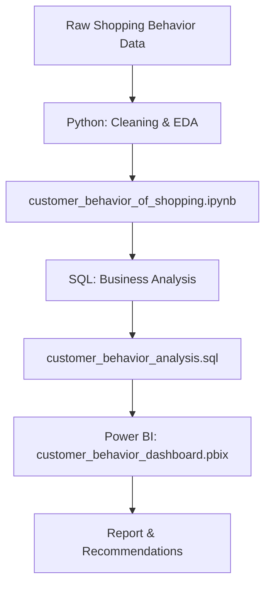

# 🛍️ Customer Behavior Analysis Project


An end-to-end customer analytics project that takes raw shopping behavior data through Python-based cleaning and EDA, SQL-driven business analysis, and into an interactive Power BI dashboard covering subscription behavior, category performance, and demographic trends.

Written for two audiences: as the person building the pipeline, you'll find the methodology and a reproducibility note worth acting on; as the analyst reading the output, you'll find the actual findings and recommendations pulled from the dashboard.

---

## Platform at a glance

| Metric | Value |
|---|---|
| Number of Customers | **3.9K** |
| Average Purchase Amount | **$59.76** |
| Average Review Rating | **3.75 / 5** |
| Subscribed Customers | **27%** |
| Non-Subscribed Customers | **73%** |

---

## Workflow



Splitting the pipeline this way keeps each stage doing one job: Python handles data quality and shape, SQL handles business-logic questions (segments, loyalty, retention) against the cleaned data, and Power BI is purely a presentation layer on top of already-validated numbers.

---

## Dashboard


---

## Building the pipeline: methodology

**1. Data preparation & EDA (`customer_behavior_of_shopping.ipynb`)**
- Cleaned and preprocessed raw shopping behavior data
- Handled missing values and inconsistencies
- Ran exploratory analysis to identify initial patterns before any dashboard work began

**2. Business analysis (`customer_behavior_analysis.sql`)**
- Simulated business-relevant queries: segmentation, loyalty, retention, and purchase-driver questions
- Kept these as SQL rather than notebook code so the logic is portable to any warehouse or BI tool later

**3. Visualization (`customer_behavior_dashboard.pbix`)**
- One dashboard covering subscription status, category revenue, gender, age group, and location — built to be explored via slicers rather than read as a static report

**A gap worth closing**
The location panel shows only four states (Montana, California, Idaho, Illinois). Before drawing conclusions from it, confirm whether that's the full dataset or a scrolled/truncated view — the same pattern showed up as a scrollable, cut-off list in an earlier project's city breakdown. If it's truncated, the "Montana leads" finding below could look very different once the full list is visible.

---

## Key findings

**1. The subscription base is the single largest untapped segment.**
Only **27% of the 3.9K customers are subscribed** — the remaining **73% are not**. At a healthy $59.76 average purchase amount, converting even a modest share of that non-subscribed majority is likely the highest-leverage move available in this dataset, since it doesn't require acquiring a single new customer.

**2. Revenue is concentrated in two of four categories.**
Clothing and Accessories together account for roughly **70%+ of category revenue**, with Footwear and, especially, Outerwear trailing well behind. That's a meaningful reliance on two categories rather than a balanced product mix.

**3. Gender split in sales is close to even.**
Sales by gender show Male and Female customers contributing similar volumes, with no dominant skew — this is a customer base that doesn't need (and might not respond well to) heavily gender-targeted campaigns.

**4. No single age group dominates — but Young Adults lead.**
Revenue by age group is fairly evenly spread across Young Adult, Middle Aged, Adult, and Senior, with Young Adult modestly on top. The demographic base is broad rather than concentrated in one cohort.

**5. Montana outperforms California — a result worth verifying, not just accepting.**
In a typical retail dataset, California (a far larger market) would be expected to lead. Here, Montana tops the location chart. That's either a genuinely interesting regional signal (strong local marketing, less competition) or an artifact of a small/synthetic dataset or a truncated location list — see the data gap flagged above.

**6. A 3.75 average review rating is middling, and nothing on the dashboard yet explains why.**
There's no cut of review score by category, subscription status, or location, so it's currently impossible to tell whether dissatisfaction is concentrated somewhere specific (a weak category, non-subscribers) or spread evenly across the base.

---

## Recommendations, ranked by expected impact

1. **Launch a subscription-conversion campaign targeting the 73% non-subscribed base.** This is the highest-leverage lever visible in the data — a modest conversion rate improvement compounds against an already-solid $59.76 average purchase amount without any new customer acquisition cost.
2. **Investigate why Footwear and Outerwear underperform** relative to Clothing and Accessories — pricing, assortment, or product presentation are the likely levers, and reducing reliance on two categories lowers overall revenue risk.
3. **Add a review-score breakdown by category, subscription status, and location** before treating the 3.75 average as fully understood — right now it's a single number with no diagnostic power behind it.
4. **Verify the Montana-over-California result** before reallocating any marketing budget toward it — confirm the location panel isn't truncated and that the sample size behind Montana is large enough to trust.
5. **Keep marketing broad across gender and age group** rather than narrowly targeted — the data shows a genuinely balanced customer base on both dimensions, so segmentation effort is better spent elsewhere (subscription status, category).

---

## Getting started

```bash
# 1. Clone the repository
git clone <repository-url>
cd <repository-folder>

# 2. Run the Python analysis
jupyter notebook customer_behavior_of_shopping.ipynb

# 3. Execute the SQL queries
# Open customer_behavior_analysis.sql in your SQL environment and run the queries

# 4. Open the Power BI dashboard
# Launch Power BI Desktop and open customer_behavior_dashboard.pbix
```

---

## Tools & technologies

| Area | Technology |
|---|---|
| Data Cleaning & EDA | Python |
| Business Analysis | SQL |
| Visualization | Power BI |
| Development | Jupyter Notebook |

---

## Project structure

```text
customer-behavior-analysis/
├── customer_behavior_of_shopping.ipynb   # Data preparation, cleaning & EDA (Python)
├── customer_behavior_analysis.sql        # SQL queries for business analysis
├── customer_behavior_dashboard.pbix      # Power BI dashboard for visualization
├── README.md                             # Project documentation
└── LICENSE                               # License file
```

---

## Use cases

- Retail analytics and customer segmentation
- Subscription and retention strategy
- Marketing optimization by category and demographic
- Business intelligence reporting for stakeholder decision-making

---

## Future improvements

- **A review-score dimension** joined to category, subscription status, and location, so satisfaction can be diagnosed rather than just reported as one average
- **Full validation of the location dataset**, confirming whether the four-state view is complete or truncated before it drives budget decisions
- **Machine learning models** to predict subscription conversion likelihood, so the campaign in recommendation #1 can be targeted rather than blanket
- **Automated reporting pipeline** connecting the notebook, SQL layer, and Power BI refresh into a single scheduled process
- **Deployment as a web-based dashboard** for easier stakeholder access outside of Power BI Desktop

---

## License

This project is licensed under the terms specified in the `LICENSE` file.

## Author

**Mohd Faizanul Haque**
Data Analytics · Business Intelligence · Analytics Engineering

---

## Author

**Mohd Faizanul Haque**
Data Analytics · Business Intelligence · Analytics Engineering


