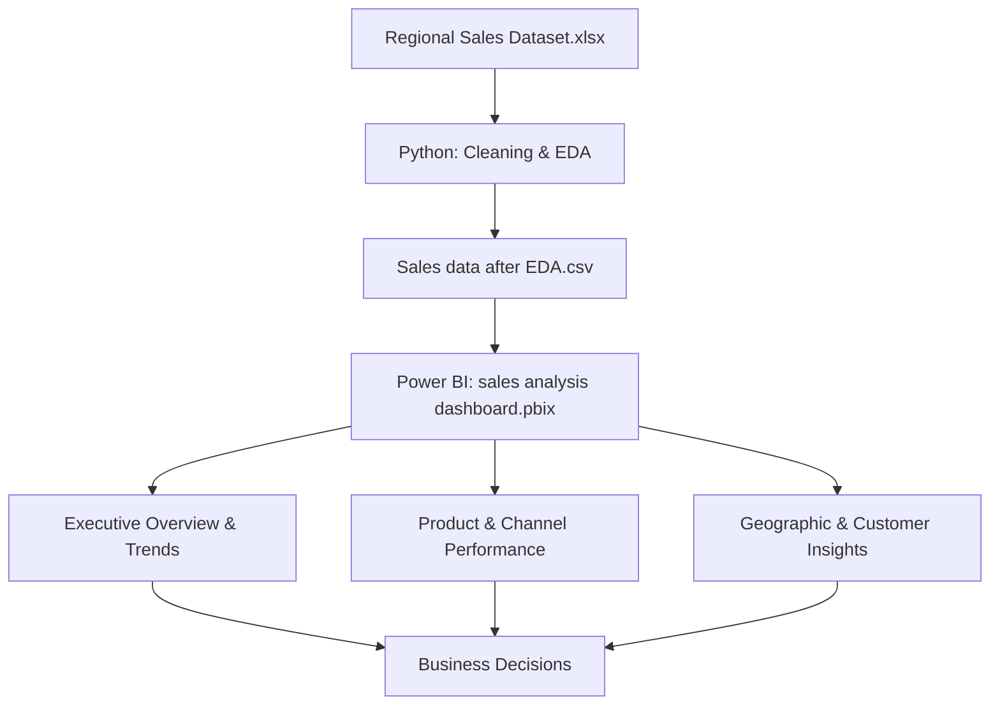

# 📊 Sales Analytics Project


An end-to-end sales analytics project that takes a raw regional sales dataset through Python-based cleaning and exploratory analysis and into a three-page executive Power BI dashboard covering revenue trends, product/channel performance, and geographic customer insights.

Written for two audiences: as the person building the pipeline, you'll find the data preparation methodology and reproducibility notes; as the analyst reading the output, you'll find the actual findings and recommendations pulled from the dashboard.

---

## Platform at a glance

| Metric | Value |
|---|---|
| Total Revenue | **$1.2B** |
| Total Profit | **~$461M** |
| Profit Margin | **37.36%** |
| Total Orders | **64K** |
| Revenue per Order | **$19.3K** |
| Top State (California) | **19.5% of revenue ($228.8M)** |

---

## Workflow



Keeping cleaning and transformation entirely in Python before anything reaches Power BI means every number on the dashboard traces back to a reproducible, version-controlled step — not a manual Excel edit that can't be audited later.

---

## Dashboards

**Executive Overview & Trends**


**Product & Channel Performance**


**Geographic & Customer Insights**


*(Export these three pages from the .pbix and place them alongside this README, or replace the paths above with hosted GitHub asset links.)*

---

## Building the pipeline: methodology

**1. Data preparation & EDA (`sales_analytics.ipynb`)**
- Imported and profiled the raw regional sales dataset
- Handled missing values and inconsistent entries (product IDs, channel labels, date formats)
- Ran exploratory analysis to surface early trends before any visualization work began

**2. Transformation (`Sales data after EDA.csv`)**
- Structured and exported a clean dataset specifically shaped for Power BI consumption, so the dashboard layer never has to re-clean or re-derive fields the notebook already resolved

**3. Visualization (`sales analysis dashboard.pbix`)**
- Three purpose-built pages rather than one crowded dashboard: trend-level KPIs, product/channel economics, and geographic/customer detail — each answering a different class of question

**A reproducibility gap worth closing**
The notebook and the `.pbix` are currently two separate artifacts with no automated link between them — if the raw Excel file is refreshed, someone has to remember to re-run the notebook and re-export the CSV before Power BI reflects it. A short script (or Power Query step) that regenerates the CSV and refreshes the dataset in one action would remove that manual dependency.

**A metric-consistency issue found while reviewing the dashboards**
The *Profit Pulse* chart on the Executive Overview page peaks in **May**, while the *profit by month* chart on the Geographic & Customer Insights page peaks in **January** with a shape that doesn't match. These are likely built on different filters or aggregation levels (e.g., one may be filtered to a region or product subset), but as they stand, two pages of the same dashboard would give a stakeholder two different answers to "when was our best month?" This should be reconciled — or the filter difference made explicit — before either chart is used for planning.

---

## Key findings

**1. The channel that makes the least revenue is the most profitable per sale.**
Export brings in only **14.6% of revenue ($180.6M)** but posts the **highest margin of the three channels (38.01%)** — ahead of Distributor (37.65%) and Wholesale (37.02%), despite Wholesale generating over half of all revenue ($668.2M, 54.06%). The largest channel is quietly the least margin-efficient.

**2. The biggest revenue product isn't a top-margin product.**
Product 26 leads revenue at **$0.12bn**, and Product 25 follows at **$0.11bn** — but neither cracks the top of the margin leaderboard (topped by Product 9 at 40.0%). Only Product 25 appears near the bottom of the margin top-10 (38.0%). The products carrying the most revenue weight are not the ones doing the most profitable work per dollar.

**3. Customer concentration risk is low.**
The top 5 customers by revenue (Aibox Company $13M down to Realbuzz Ltd $11M) total roughly **$58M — under 5% of total revenue**. No single account is large enough to meaningfully threaten the business if lost, which is a genuine structural strength worth protecting rather than a gap to fix.

**4. California is nearly double the next-largest state, but region-level performance is more balanced.**
California alone drives **19.5% of revenue ($228.8M)**, almost double Illinois in second place ($111.05M). At the region level, though, West (30.1%), South (27.1%), and Midwest (25.9%) are fairly close together — only Northeast trails meaningfully at **16.9%**.

**5. Profit margin doesn't track unit price the way you'd expect.**
The unit price vs. profit margin scatter shows margins spread roughly 20–60% across every price band, from sub-$1K to $5K–$7K items. High-margin orders exist at every price point — meaning price tier alone isn't what's driving profitability, and something else (customer segment, channel, discounting behavior) is likely the real lever.

**6. Order volume is dominated by many small transactions, not a few large ones.**
The order value spectrum is sharply right-skewed: the vast majority of the ~64K orders fall under $100K, with a long thin tail out to $0.5M. Operational efficiency at high order volume matters more here than managing a handful of large deals.

---

## Recommendations, ranked by expected impact

1. **Grow the Export channel deliberately.** It's already the most margin-efficient channel at 38.01% but only 14.6% of revenue. Shifting even a modest share of investment or sales focus from Wholesale toward Export is likely to lift blended margin without a proportional loss in revenue.
2. **Audit pricing and cost structure on Product 26 and Product 25 specifically.** They carry the largest share of total revenue but sit outside the top-margin tier — a small margin improvement on these two products alone would move company-wide profitability more than a similar gain on a smaller product.
3. **Run a proper margin-driver analysis** (customer segment, channel, discount level) rather than assuming price tier explains profitability — the scatter plot shows it doesn't, and Export's outsized margin suggests channel strategy is a stronger lever than pricing alone.
4. **Investigate why Northeast trails the other three regions by 9–13 points of revenue share** — determine whether it's market saturation, weaker sales coverage, or a genuine product-market fit gap before deciding whether to invest further or reallocate resources.
5. **Reconcile the two conflicting profit-by-month views** before either is used in forecasting or planning — this is a data-engineering fix, but it directly protects the reliability of every seasonal finding above it.

---

## Tools & technologies

| Area | Technology |
|---|---|
| Data Cleaning & EDA | Python (Pandas, NumPy, Matplotlib, Seaborn) |
| Source Data | Excel |
| Visualization | Power BI |
| Development | Jupyter Notebook |

---

## Project structure

```text
sales-analytics-project/
├── Regional Sales Dataset.xlsx      # Raw dataset
├── Sales data after EDA.csv         # Cleaned dataset after analysis
├── sales_analytics.ipynb            # Data cleaning & exploratory analysis (Python)
├── sales analysis dashboard.pbix    # Power BI dashboard
├── README.md                        # Project documentation
└── LICENSE                          # License file
```

---

## Getting started

```bash
# 1. Clone the repository
git clone <repository-url>
cd <repository-folder>

# 2. Run the Python notebook
jupyter notebook sales_analytics.ipynb

# 3. Open the Power BI dashboard
# Open "sales analysis dashboard.pbix" in Power BI Desktop
```

---

## Use cases

- Sales performance tracking across regions, channels, and products
- Business decision support for pricing and channel investment
- Revenue and margin optimization
- Regional and account-level strategy planning

---

## Future improvements

- **Predictive sales forecasting** on top of the existing revenue and profit trends
- **Real-time or scheduled data refresh** to remove the manual notebook → CSV → Power BI handoff
- **Enhanced dashboard interactivity** (drill-through from region to state to customer)
- **A margin-driver model** to formally test which factors (channel, segment, discounting) explain profitability better than price tier

---

## Author

**Mohd Faizanul Haque**
Data Analytics · Business Intelligence · Analytics Engineering


